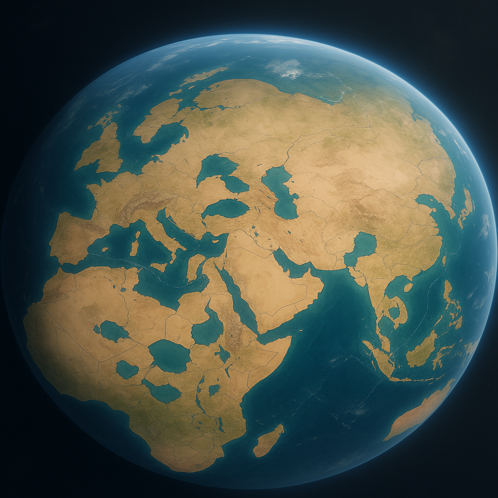

# Supercontinent Models: Literature Review

**Date:** 2025-12-18
**Purpose:** Review of supercontinent reconstructions and their relevance to the Hydrotectonic Model
**Relevance:** Understanding pre-Flood continental configuration and breakup dynamics

---

## Executive Summary

Pangaea is the most recent and best-understood supercontinent, assembled ~335 Ma and beginning breakup ~200 Ma. The PALEOMAP Project (Scotese) provides the most comprehensive and widely-used reconstructions. For the Hydrotectonic Model, Pangaea represents the likely antediluvian continental configuration - a single landmass that catastrophically fragmented during the Flood event.

*Figure 1: Pangaea supercontinent reconstruction showing the configuration of continental masses prior to breakup.*

---

## 1. The Supercontinent Cycle

### 1.1 Major Supercontinents in Earth History

| Supercontinent | Time Period | Duration | Notes |
|----------------|-------------|----------|-------|
| Vaalbara | ~3.6-2.8 Ga | ~800 Myr | Earliest proposed; disputed |
| Kenorland | ~2.7-2.1 Ga | ~600 Myr | Archean supercontinent |
| Columbia/Nuna | ~1.8-1.3 Ga | ~500 Myr | First well-documented |
| Rodinia | ~1.1-0.75 Ga | ~350 Myr | Pre-Cambrian; well-studied |
| Pannotia | ~630-540 Ma | ~90 Myr | Short-lived; debated |
| Gondwana | ~550-180 Ma | ~370 Myr | Southern supercontinent |
| Pangaea | ~335-200 Ma | ~135 Myr | Most recent; best understood |

**Source:** [Supercontinent (Wikipedia)](https://en.wikipedia.org/wiki/Supercontinent)

### 1.2 The Supercontinent Cycle

Supercontinents form through two end-member mechanisms:
1. **Introversion:** Interior ocean floor is preferentially subducted (e.g., Pangaea formation)
2. **Extroversion:** Exterior ocean floor is subducted, continents reassemble on opposite side

The cycle influences:
- Global climate patterns
- Ocean circulation
- Biodiversity
- Sea level
- Volcanic activity

**Source:** [The Supercontinent Cycle: Patterns and Impacts (GeoExpro)](https://geoexpro.com/the-supercontinent-cycle-patterns-and-impacts/)

---

## 2. Pangaea: The Best-Understood Supercontinent

### 2.1 Why Pangaea is Best Understood

Pangaea is the most recent supercontinent and therefore has:
- Best-preserved geological evidence
- Most complete paleomagnetic data
- Clearest continental margin fits
- Extensive fossil distribution data

"Because Pangaea is the most recent of Earth's supercontinents, it is the best known and understood. Its reconstruction is almost as simple as fitting together the present continents bordering the Atlantic ocean like puzzle pieces."

**Source:** [Pangaea (Wikipedia)](https://en.wikipedia.org/wiki/Pangaea)

### 2.2 Pangaea Configuration

**Shape:** C-shaped, stretching between polar regions

**Components:**
- **Laurasia** (Northern): North America, Europe, Asia
- **Gondwana** (Southern): South America, Africa, Antarctica, Australia, India

**Surrounding features:**
- **Panthalassa:** Superocean surrounding Pangaea
- **Tethys Sea:** Embayment on eastern edge (between Laurasia and Gondwana arms)

### 2.3 Timeline

| Event | Time | Description |
|-------|------|-------------|
| Assembly begins | ~335 Ma | Carboniferous collisions |
| Maximum extent | ~250 Ma | Late Permian |
| Breakup begins | ~200 Ma | End Triassic/Early Jurassic |
| Laurasia-Gondwana split | ~180 Ma | Central Atlantic opens |
| Final fragmentation | ~130-65 Ma | South Atlantic, Indian Ocean open |

### 2.4 Evidence for Pangaea

**Geological evidence:**
- Matching mountain chains across continents (Appalachians-Caledonian-Scandinavian)
- Continuous geological formations across now-separated continents
- Matching coastline geometries

**Paleontological evidence:**
- Identical fossil species on now-separated continents
- *Mesosaurus* (freshwater reptile) in both South America and Africa
- *Glossopteris* flora across southern continents
- *Lystrosaurus* distribution across Gondwana fragments

**Paleomagnetic evidence:**
- Apparent polar wander paths converge when continents reassembled
- Magnetic mineral orientations consistent with unified landmass

**Paleoclimatic evidence:**
- Glacial deposits in India, Africa, South America, Australia align when reassembled
- Coal deposits and evaporites match expected climate zones

**Sources:**
- [Pangea (Britannica)](https://www.britannica.com/place/Pangea)
- [Pangaea facts (Live Science)](https://www.livescience.com/38218-facts-about-pangaea.html)

---

## 3. The PALEOMAP Project

### 3.1 Overview

The PALEOMAP Project, led by Dr. Christopher Scotese (Northwestern University), is the most comprehensive effort to reconstruct Earth's paleogeography.

**Goals:**
- Illustrate plate tectonic development of ocean basins and continents
- Map changing distribution of land and sea over 1.1 billion years
- Provide high-resolution paleoelevation models

**Output:**
- 117 PaleoDEMs (Paleo-Digital Elevation Models)
- 91 paleogeographic maps for GPlates
- Computer animations of continental drift
- Peer-reviewed publications

**Source:** [PALEOMAP Project](http://www.scotese.com/)

### 3.2 Technical Specifications

**PaleoDEM resolution:**
- Standard: 1° × 1° grid
- High resolution: 0.1° × 0.1° (available on Zenodo)

**Time coverage:**
- Phanerozoic and late Neoproterozoic
- 5 million year intervals for past 540 Myr

**Features mapped:**
- Deep oceans
- Shallow seas
- Lowlands
- Mountains
- Continental shelves

**Sources:**
- [PaleoDEM Resource (EarthByte)](https://www.earthbyte.org/paleodem-resource-scotese-and-wright-2018/)
- [PALEOMAP PaleoDEMs](https://www.earthbyte.org/webdav/ftp/Data_Collections/Scotese_Wright_2018_PaleoDEM/Scotese_Wright2018_PALEOMAP_PaleoDEMs.pdf)

### 3.3 Key Publications

1. Scotese, C.R. (2021). An Atlas of Phanerozoic Paleogeographic Maps: The Seas Come In and the Seas Go Out. *Annual Review of Earth and Planetary Sciences*, 49(1), 679-728.

2. Scotese, C.R. & Wright, N. (2018). PALEOMAP Paleodigital Elevation Models (PaleoDEMS) for the Phanerozoic.

3. Scotese, C.R. (2020). Deconstructing Tectonics: Ten Animated Explorations. *Earth and Space Science*.

**Source:** [Deconstructing Tectonics (Wiley)](https://agupubs.onlinelibrary.wiley.com/doi/full/10.1029/2019EA000989)

---

## 4. Rodinia: The Pre-Pangaean Supercontinent

### 4.1 Overview

Rodinia existed ~1.1-0.75 Ga during the Proterozoic Eon - the supercontinent that preceded Pangaea by several hundred million years.

### 4.2 Formation Evidence

**Orogenic belts:**
- Grenville Orogeny (eastern North America)
- Dalslandian Orogeny (Europe)
- Similar-age orogens on virtually all cratons worldwide

**Rifting evidence:**
- Extensive lava flows and volcanic eruptions ~750 Ma
- Widespread dike development in Kalahari craton ~800 Ma

**Source:** [Rodinia (Wikipedia)](https://en.wikipedia.org/wiki/Rodinia)

### 4.3 Connection to Gondwana

Before Rodinia completely broke up, some fragments had already come together to form Gondwana by ~608 Ma. This demonstrates the continuous nature of the supercontinent cycle.

---

## 5. Implications for the Hydrotectonic Model

### 5.1 Pre-Flood Configuration

The Hydrotectonic Model proposes that the antediluvian Earth featured a single landmass - consistent with Pangaea or a similar supercontinent configuration.

**Biblical correlation:**
- Genesis 1:9: "Let the waters under the heavens be gathered together into one place, and let the dry land appear"
- Implies single landmass ("dry land") and single ocean basin ("one place")

### 5.2 Breakup Mechanism

Conventional model: Gradual rifting over ~135 Myr driven by mantle convection

Hydrotectonic model: Catastrophic fragmentation during Stage 2 (Flood event)
- Meteor impacts trigger seal failure
- Hydraulic collapse enables rapid block motion
- Continental fragments "hydroplane" to current positions

### 5.3 Key Observations to Explain

1. **Continental fit:** Modern continents fit together as puzzle pieces - consistent with recent separation
2. **Mid-ocean ridges:** Linear features where new oceanic crust forms - could represent fracture zones from breakup
3. **Matching geology:** Continuous formations across continents - require explanation in any model
4. **Fossil distribution:** Identical species on separated continents - timing of separation is key question

### 5.4 Model Advantages

The Hydrotectonic Model accounts for:
- Rapid separation without lethal heat generation
- Energy source (gravitational battery) for motion
- Preservation of continental integrity during rapid motion
- Transition to modern slow plate tectonics

---

## 6. Resources

### 6.1 Online Tools

- **PALEOMAP Project:** http://www.scotese.com/
- **GPlates:** https://www.gplates.org/ (plate reconstruction software)
- **EarthByte:** https://www.earthbyte.org/ (paleogeographic data)
- **Ancient Earth Globe:** https://dinosaurpictures.org/ancient-earth (interactive visualization)

### 6.2 High-Resolution Data

- Zenodo PaleoDEMs: https://doi.org/10.5281/zenodo.5460860
- NOAA Science on a Sphere: [PALEOMAP PaleoAtlas](https://sos.noaa.gov/catalog/datasets/paleomap-paleoatlas-0-750-million-years-ago/)

### 6.3 Animations

PALEOMAP animations available at scotese.com:
- Breakup of Pangaea (last 200 Myr)
- Assembly of Pangaea during Paleozoic
- Late Precambrian Pangeas (Rodinia to Pannotia)
- Future projections (250 Myr into future - "Pangaea Proxima")

---

## 7. Key References

1. Scotese, C.R. (2021). An Atlas of Phanerozoic Paleogeographic Maps. *Annual Review of Earth and Planetary Sciences*, 49, 679-728.

2. Evans, D.A.D. (2013). Reconstructing pre-Pangean supercontinents. *GSA Bulletin*, 125(11-12), 1735-1751.

3. Meert, J.G. (2012). What's in a name? The Columbia (Paleopangaea/Nuna) supercontinent. *Gondwana Research*, 21(4), 987-993.

4. Li, Z.X., et al. (2008). Assembly, configuration, and break-up history of Rodinia: A synthesis. *Precambrian Research*, 160(1-2), 179-210.

5. Torsvik, T.H. & Cocks, L.R.M. (2017). *Earth History and Palaeogeography*. Cambridge University Press.

---

## Document Information

**Compiled by:** Claude (AI assistant)
**For:** James (JD) Longmire
**Project:** Global Flood Hydrotectonics
**Status:** Initial literature review
